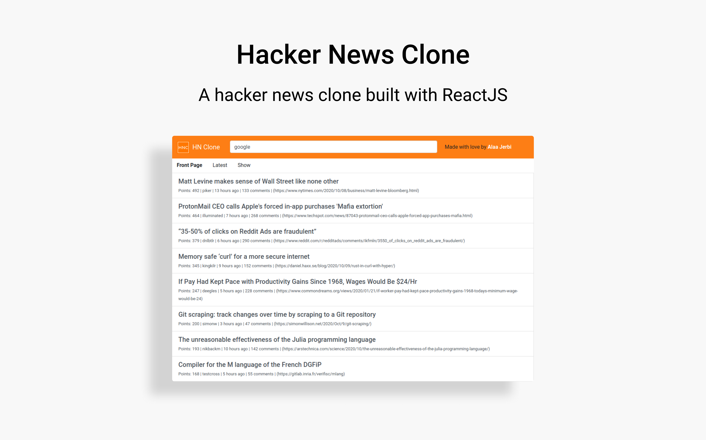

# Hacker News Clone

A hacker news clone built with ReactJS. With highlighted search keywords and pagination.



## Live preview
You can view the final app [here.](https://alaajerbi.github.io/hackernews-clone)

## Run the app in development mode
1) Clone this repo 
2) Install the necessary node dependencies
```
npm install
```
3) Run the app locally
```
npm start
```
4) Open [http://localhost:3000](http://localhost:3000) to view it in the browser.


This project was bootstrapped with [Create React App](https://github.com/facebook/create-react-app).
